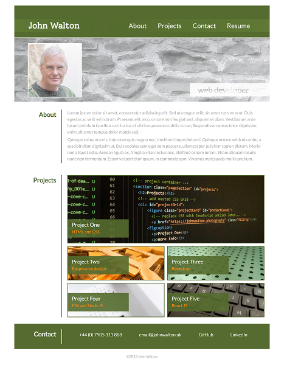

# 02 - Portfolio

## Description
	
A responsive portfolio landing page.

HTML and CSS code has been used with variables, FlexBox and CSS Grid to create a responsive webpage. 

	
	
## Installation
	
n/a
	
## Usage
	
A live published page can be found at: https://forestdean.github.io/02-portfolio/ 

Navigation links take the user to the corresponding section and Projects are displayed as `null` placeholder image links. When the page is resized the layout will respond at the 992px, 768px and 576px breakpoints.

For the mobile layout, a placeholder 'hamburger' icon has been postioned at the top of the screen. A JavaScript `onClick` function will be installed to reveal the menu with a transition.
	
    
To view HTML source code, right-click the webpage and select `View page source` (Windows) or select `Develop > Show Page Source` (macOS)

With [**Chrome DevTools**](https://www.google.com/intl/en_uk/chrome/dev/), by pressing `Control+Shift+I` (Windows) or `Command+Option+I` (macOS), a panel is opened allowing access to the CSS applied to the webpage.
	
## Credits
	
Google Fonts - https://fonts.google.com/

## License
	
**MIT** - Please refer to the LICENSE in the repository.
